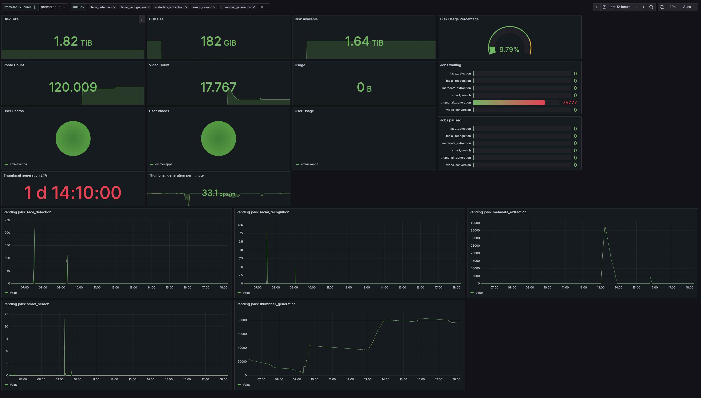

# Immich Exporter

This is a basic implementation of a prometheus exporter designed for exporting metrics of Immich.

## Docker Image

`eithan1231/immich:latest`

## Setup - Docker Compose

The recommended setup is with Docker compose.

```yaml
services:
  immich-exporter:
    container_name: immich_exporter
    image: eithan1231/immich-exporter
    restart: always
    ports:
      - 3000:3000
    environment:
      # The connection hostname to your immich server. Valid Examples:
      # - immich.potato.com
      # - https://immich.potato.com
      # - https://immich.potato.com:2000
      # - https://immich.potato.com/
      IMMICH_HOST: https://immich.potato.com

      # This key is generated from your user-dashbaord. Navigate to `/user-settings` and there is a
      # "API Keys" section. Generate a key and place it here.
      IMMICH_KEY:
```

## Setup - Grafana

### Dashbard.json

Import the following json dashboard to you Grafana dashboards.

`/grafana/dashboard.json`

### Screenshot


